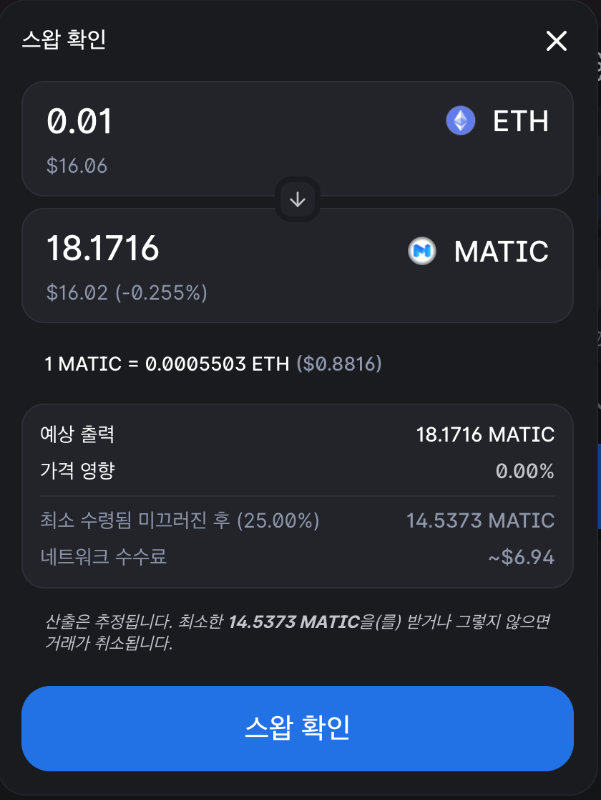
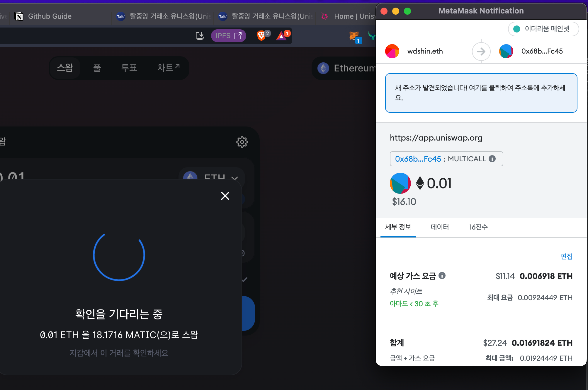

# 1st-EVM-Assignment

# Done

## 1. 지갑을 만드는 과정에서의 궁금증?

* 지갑을 만든지는 오래 되어서 당시의 궁금증을 회상하여 적겠습니다.

  * passphase 가 매우 생소 했습니다. 
    * 단순한 암호 몇자로는 지갑을 보호하기 어렵기 때문이라고 생각했습니다. 
      * 그러나, 여전히 passphase 로는 지갑을 보호하기 어렵다고 생각합니다.
      * 또한, 오프라인에 적어둔 것을 잃어버린다면 매우 위험해질 것입니다.
      * 지갑이 아닌 거래소 계정에서는 보인 인증 및 OTP와 같은 2차 인증을 사용합니다.
  * 크롬 플러그인을 통해서 지갑을 열고 사용하는 것 또한 매우 생소했습니다.
    * 익숙해지면 편리하긴 합니다만, 처음 사용자에게는 크롬 플러그인 자체라는 것을 이해하지 못할 것입니다.
  * 출금 및 송금이 초보자에게는 매우 쉽지 않았던 과정으로 기억합니다.
    * 출금 주소/입금 주소라는 개념도 어렵고, 토큰의 프로토콜에 맞춰야 하는 것도 어렵습니다.
  * 결론 : 잃어버려도 본인 인증을 통해서 찾아주는 서비스와 은행처럼 입출금이 쉬운 서비스가 생겨야 한다고 생각합니다.

## 2. 구매한 이더리움으로 폴리곤으로 스왑

* 매우 쉽습니다.
* 처음에 지갑이 연결이 안되었는지, 기다리는 메시지가 길었습니다. 다시 리로드 해서 성공했습니다.
* 인증샷
  * 
  * 

### 3. OpenSea에서 Polygon 기반 NFT 구매하기

* 이미 ETH로 구매 많이 해 봤습니다. ㅠㅠ
  * 많은 NFT 사이트에서 디스코드도 활동하고 구매도 많이 했었습니다.
  * ETH 400만원일때 비싸게 많이 샀었네요. ㅠㅠ
  * 스캠도 많이 당했습니다. 1ETH 에 산 것을 지갑에서 탈취당하기도 했습니다.
* 인증샷
  * 

### 4.기존 예치와 대출 시스템에 비해 DeFi를 활용한 방법은 어떤 점이 다른 것 같은가요? 

* 지갑에서 직접 연결하여 예치할 수 있다는 점이 매력적입니다.
* ETH보다 Polygon기반이라 가스비가 싸다는 점이 매력적입니다.
* 왜냐하면, 아직 Defi는 위험하다고 생각했습니다. 
  * 많이 맡기기엔 위험해 보였습니다.
  * 어떤 것을 믿고 맡겨도 될 지, 아직 잘 모르겠습니다.
  * 바이낸스의 Cefi 정도 경험었습니다. ADA기반 Defi인 MINSWAP으로 예치한 경험이 있습니다.
* Insight를 가지려면 더 경험을 해 봐야 할 것 같습니다. 이번 기회에 더 해 보겠습니다.

# Todo

1.  ****암호화폐 거래소에서 0.01 이더리움 내외(2022년 4월 8일 기준 4만원 내외)을 구매하고, 자신만의 메타마스크 지갑을 만든 뒤 이를 본인의 메타마스크 지갑으로 송금해보세요. 그리고 무언가 하나의 지갑을 만드는 과정에서, 어떤 궁금증이 생기셨나요? 의문을 던져보고, 설명해주세요.****
    - [암호화폐 지갑을 사용해야 하는 이유](https://dcrypto.tistory.com/876)
    - [암호화폐 지갑 사용 방법: 메타마스크](https://dcrypto.tistory.com/888)
    - [코인 출금 전에 알아야 할 필수 기초 상식](https://dcrypto.tistory.com/902)
    - [거래소에서 메타마스크로 코인 송금하는 방법](https://www.steemcoinpan.com/hive-101145/@donekim/38qazr)
    - [NFT 101 메타마스크에서 입출금 해보기](https://m.post.naver.com/viewer/postView.naver?volumeNo=33335828&memberNo=15388801)
2. 구매한 Ethereum을 가지고 Polygon으로 스왑해보기, 스왑을 해보면서 어떤 것이 힘들었나요? 해당 부분에 대해서 느낀 점을 설명해주세요.
    - [유니스왑 사용법](https://talken.io/board/post/INFO/66992)
3. Opensea에서 Polygon 기반 NFT 구매해보기 (optional)
4. Polygon 기반 Lending protocol으로 예치하고, 대출해보기, 기존 예치와 대출 시스템에 비해 DeFi를 활용한 방법은 어떤 점이 다른 것 같은가요?
    - [AAVE](https://app.aave.com/)
    - [AAVE 사용법](https://zephyrnet.com/ko/aave-%ED%94%8C%EB%9E%AB%ED%8F%BC-%EC%82%AC%EC%9A%A9-%EB%B0%A9%EB%B2%95-%EC%A0%84%EC%B2%B4-%EA%B0%80%EC%9D%B4%EB%93%9C/)

## **과제 제출하기 전에!**

- 레포지토리를 Fork해주세요. Markdown 파일로 답변을 작성한 후 week1 폴더에 저장해서 Pull Request를 보내주세요.
    - 파일 이름은 `week1_본인아이디.md` 로 부탁드립니다!
- 7월 22일(금) 00:00까지 작성 후, main 브랜치로 Pull Request를 보내주세요.
- 도움이 필요하시면 언제든지 디스코드 내 `1ST-EVM-COHORT` 채널로 연락주세요 :)
